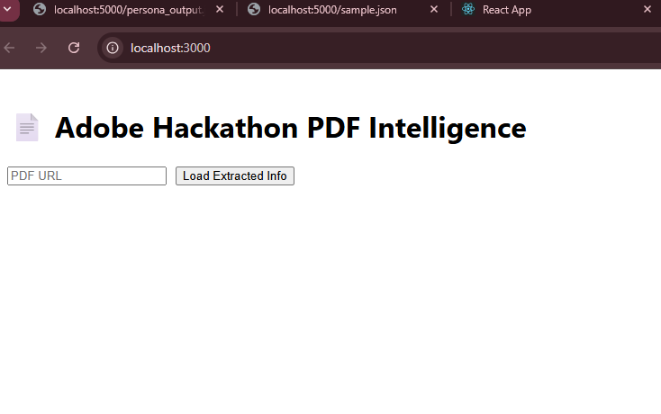
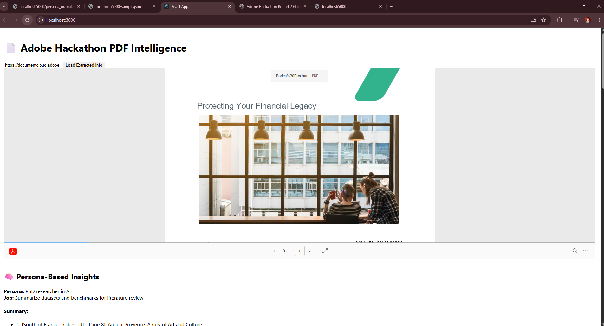
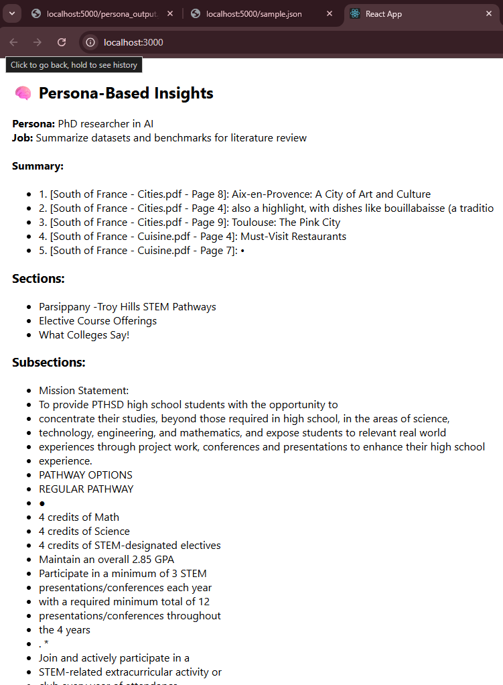
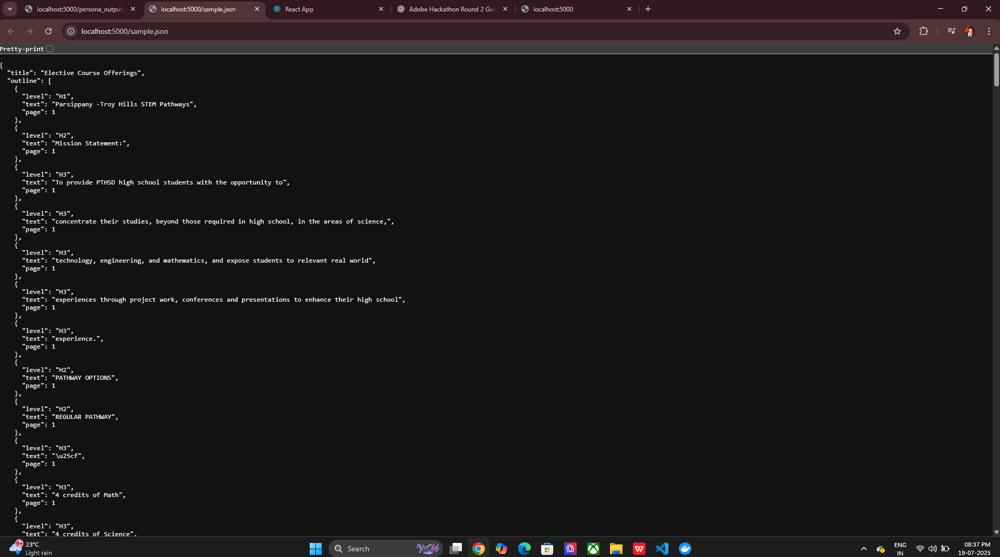
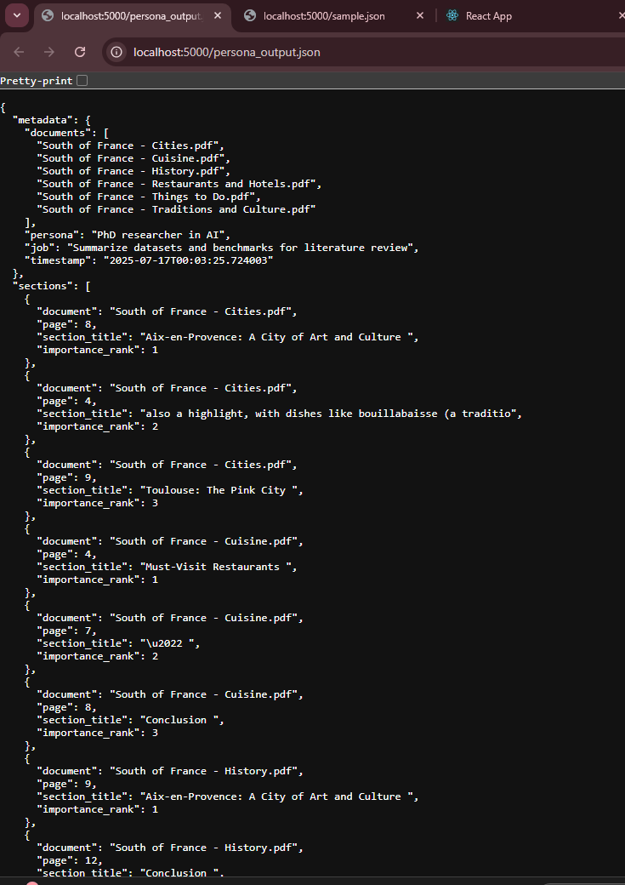
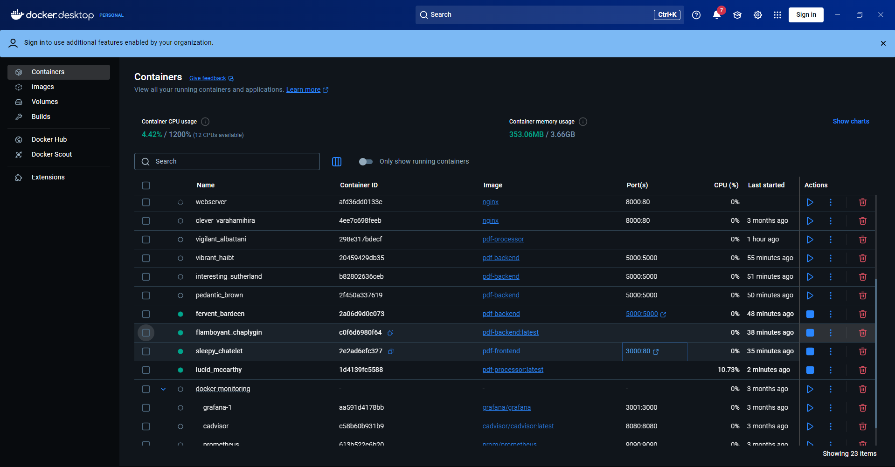
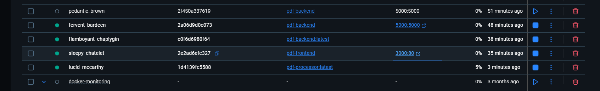

# 🧠 Adobe Hackathon 2025 - PDF Intelligence Tool

A smart, interactive PDF Intelligence Web Application that uses the **Adobe PDF Embed API** to preview documents and extract **personalized insights** such as key sections, subsections, and persona-specific summaries using a hybrid **Python–React–Docker** stack.

This project was built as part of Adobe India Hackathon 2025 – Round 2: Build & Connect Challenge.

---

## 🌟 Application Overview

This tool allows users to:

1. **Preview PDFs** interactively using Adobe’s PDF Embed API.
2. **Analyze document content** using a backend AI pipeline.
3. **Display structured summaries** of the most relevant document sections based on a target *persona* and *job role*.
4. **View extracted sections and subsections** in a user-friendly format.
5. **Deploy the entire stack using Docker** for seamless execution.

---

## 📸 Screenshots

### 🏠 Homepage – Enter PDF URL


### 📄 PDF Viewer Embedded


### 🧠 Persona-Based Insights


### Backend– Enter PDF URL

### Backend– Enter PDF URL

### Docker– Enter PDF URL

### Docker– Enter PDF URL



## 📸 How It Works

### 👁️ Step-by-Step Workflow

1. **User Inputs PDF URL** in the frontend.
2. **Adobe Embed API** renders the PDF in a viewer.
3. The frontend fetches:
   - `sample.json`: contains extracted outline (headings and levels).
   - `persona_output.json`: AI-generated summary with metadata (`persona`, `job`, `relevant sections`).
4. The React frontend uses this data to:
   - Show top sections and subsections from the outline.
   - Show summary and metadata for a specific persona/job.
5. All backend logic is Dockerized and exposes endpoints on port `5000`.

---

## 🔍 Features

✅ View any online PDF using Adobe Embed API  
✅ Automatically extracts outline (H1, H2, H3, etc.)  
✅ Persona-driven insights from multiple documents  
✅ Summary of top sections by relevance  
✅ Fully Dockerized frontend + backend  
✅ Clean and modern UI experience

---

## 📦 Technologies Used

| Layer      | Tech Stack                          |
|------------|--------------------------------------|
| Frontend   | React.js, Adobe PDF Embed API        |
| Backend    | Python (persona analyzer), Express.js |
| Infrastructure | Docker, NGINX, Node.js          |

---

## 🚀 How to Run

### 🐳 Backend (Express Server serving JSONs)

```bash
cd backend
docker build -t pdf-backend .
docker run -p 5000:5000 pdf-backend

This will serve:

http://localhost:5000/sample.json

http://localhost:5000/persona_output.json

These files contain:

Outline extracted from PDF

Persona metadata and summary

🖥️ Frontend (React + Adobe PDF Embed API)
bash
Copy
Edit
cd frontend/pdf-intelligence-frontend
docker build -t pdf-frontend .
docker run -p 3000:80 pdf-frontend
Then visit:
📄 http://localhost:3000

You’ll be able to input a PDF URL and view extracted insights side-by-side.

🔐 .env File
Create a .env file in:

bash
Copy
Edit
frontend/pdf-intelligence-frontend/.env
With this content:

env
Copy
Edit
REACT_APP_ADOBE_API_KEY=your_adobe_embed_api_key
You can get your API key from:
🔗 https://developer.adobe.com/document-services/docs/overview/pdf-embed-api/

📂 API Endpoints
These are the endpoints served by the backend container:

Endpoint	Description
/sample.json	Extracted headings/outline from the PDF
/persona_output.json	Persona metadata and top sections summary

🧠 Example Output (Displayed in App)
Persona: PhD researcher in AI
Job: Summarize datasets and benchmarks for literature review

Summary:

[Cities.pdf - Page 8]: Aix-en-Provence: A City of Art and Culture

[Cities.pdf - Page 4]: Dishes like bouillabaisse

[Cities.pdf - Page 9]: Toulouse: The Pink City

[Cuisine.pdf - Page 4]: Must-Visit Restaurants

[Cuisine.pdf - Page 7]: [No Title]

Sections:

Introduction

Financial Strategy

Contact Us

Subsections:

Company Overview

Budget Planning

🧠 Example Output (Displayed in App)
Persona: PhD researcher in AI
Job: Summarize datasets and benchmarks for literature review

Summary:

[Cities.pdf - Page 8]: Aix-en-Provence: A City of Art and Culture

[Cities.pdf - Page 4]: Dishes like bouillabaisse

[Cities.pdf - Page 9]: Toulouse: The Pink City

[Cuisine.pdf - Page 4]: Must-Visit Restaurants

[Cuisine.pdf - Page 7]: [No Title]

Sections:

Introduction

Financial Strategy

Contact Us

Subsections:

Company Overview

Budget Planning

📸 Screenshots
🖼️ screenshots/pdf_viewer.png
🖼️ screenshots/insights_section.png

(Add them to a screenshots/ folder and reference here.)

🤖 Folder Structure
plaintext
Copy
Edit
adobe-hackathon-2025/
├── backend/
│   ├── app/
│   ├── output/ (sample.json, persona_output.json)
│   ├── server.js
│   └── Dockerfile
├── frontend/
│   └── pdf-intelligence-frontend/
│       ├── public/
│       ├── src/
│       │   ├── components/
│       │   │   ├── PdfViewer.js
│       │   │   └── PersonaInsights.js
│       │   ├── App.js
│       │   └── App.css
│       ├── .env
│       └── Dockerfile
├── screenshots/
│   └── [Add screenshots here]
└── README.md
🐙 GitHub Submission Steps
bash
Copy
Edit
git init
git add .
git commit -m "🎉 Final submission for Adobe Hackathon 2025"
git remote add origin https://github.com/YOUR_USERNAME/adobe-pdf-intelligence.git
git push -u origin main
